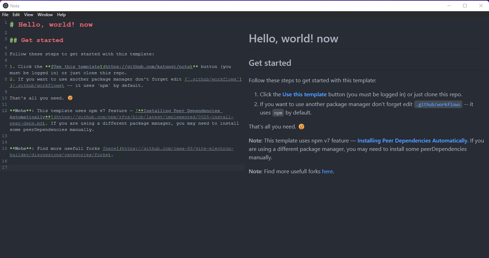

# Nota Markdown Editor

[](https://nodejs.org/about/releases/)
[](https://github.com/npm/cli/releases)

> Vite+Electron + React = 🔥



This is a fast and simple, crossplatform app for writing markdown. Written following the latest safety requirements, recommendations and best practices.

Under the hood is used [Vite] — superfast, nextgen bundler, and [electron-builder] for compilation.

___
### Support
- To generate the Boilerplate code I used the [Vite Electron Builer Template](https://github.com/cawa-93/vite-electron-builder).
- It uses Vue by default but I managed to change it to React
- This template maintained by [Alex Kozack][cawa-93-github]. You can [💖 sponsor him][cawa-93-sponsor] for continued development of this template.
___

## Get started

### Dev Mode
You can clone the repo into your local machine:
```console
git clone https://github.com/katungi/nota
```
Now you can `cd` into the app and run it:
```console
cd nota
```
Now to run the application, use the following command:
```console
npm run watch
```

### Release Mode
- ⚠️ Coming soon when I bundle the app for different formats ⚠️

## Features and Tech Used

### Electron [][electron]
- The architecture of the application is built according to the security [guides](https://www.electronjs.org/docs/tutorial/security) and best practices.
- The latest version of the [electron-builder] is used to compile the application.


### Vite [][vite]
- [Vite] is used to bundle all source codes. This is an extremely fast packer that has a bunch of great features. You can learn more about how it is arranged in [this](https://youtu.be/xXrhg26VCSc) video.
- Vite [supports](https://vitejs.dev/guide/env-and-mode.html) reading `.env` files. You can also specify types of your environment variables in [`types/vite-env.d.ts`](types/vite-env.d.ts).
- Hot reloads for `Main` and `Renderer` processes.

Vite provides you with many useful features, such as: `TypeScript`, `TSX/JSX`, `CSS/JSON Importing`, `CSS Modules`, `Web Assembly` and much more.

[See all Vite features](https://vitejs.dev/guide/features.html).


### TypeScript [][typescript] (optional)
- The Latest TypeScript is used for all source code. You know I am a Ts FanBoy 🕺
- **Vite** supports TypeScript out of the box. However, it does not support type checking.
- Code formatting rules follow the latest TypeScript recommendations and best practices thanks to [@typescript-eslint/eslint-plugin](https://www.npmjs.com/package/@typescript-eslint/eslint-plugin).
- Automatically create interface declarations for all APIs that have been passed to `electron.contextBridge.exposeInMainWorld`.
  Thanks [dts-for-context-bridge](https://github.com/cawa-93/dts-for-context-bridge)  [](https://github.com/cawa-93/dts-for-context-bridge).

### React 
- By default, web pages are built using [React]. 
- Code formatting rules follow the latest React recommendations and best practices thanks to [eslint-plugin-react].

### Continuous Integration
- The configured workflow for check the types for each push and PR.
- The configured workflow for check the code style for each push and PR.
- **Automatic tests** used [Vitest ][vitest] -- A blazing fast test framework powered by Vite. 
  - Unit tests are placed in each package and run separately.
  - End-to-end tests placed in root [`tests`](tests) directory and used [playwright]. 

  

### Continuous delivery
- Each time you push changes to the `main` branch, [`release`](.github/workflows/release.yml) workflow starts, which creates release draft.
  - The version is automatically set based on the current date in the format `yy.mm.dd-minutes`.
  - Notes are automatically generated and added to the release draft.
  - Code signing supported. See [`compile` job in `release` workflow](.github/workflows/release.yml).
- **Auto-update is supported**. After the release will be published, all client applications will download the new version and install updates silently.

### Project Structure

The structure of this template is very similar to the structure of a monorepo.

The entire source code of the program is divided into three modules (packages) that are bundled each independently:
- [`packages/main`](packages/main)
Electron [**main script**](https://www.electronjs.org/docs/tutorial/quick-start#create-the-main-script-file).
- [`packages/preload`](packages/preload)
Used in `BrowserWindow.webPreferences.preload`. See [Checklist: Security Recommendations](https://www.electronjs.org/docs/tutorial/security#2-do-not-enable-nodejs-integration-for-remote-content).
- [`packages/renderer`](packages/renderer)
Electron [**web page**](https://www.electronjs.org/docs/tutorial/quick-start#create-a-web-page).

## Contributing

Please read [CONTRIBUTING.md](https://gist.github.com/PurpleBooth/b24679402957c63ec426) for details on our code of conduct, and the process for submitting pull requests to us.

If you have **_Any_** ideas about the project, Feel free to open an issue. I have no life so I will respond almost immediately.

## Author

**Daniel Dennis** - _Initial work_ - [Other Works](https://github.com/katungi/)

See also the list of [contributors](https://github.com/your/project/contributors) who participated in this project.

## License

This project is licensed under the MIT License - see the [LICENSE.md](LICENSE.md) file for details
